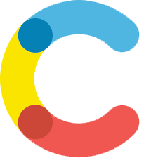

  <!-- Main banner -->
  

# Hello, I’m <strong>Ursula !!</strong>

✨ A goal-driven Full-Stack JavaScript Developer with a background in Arts and Design. I merge creativity and logic to craft accessibility-first, user-centric experiences that look as beautiful as they perform.
Passionate about blending design & tech to build meaningful products,
I spend my free time experimenting with laser-cut creations, some creative projects, and volunteering to teach kids how to code.

🌍💡I believe we all have the power to inspire and grow together, building a more equitable and inclusive society where everyone has space to flourish.

---

## About Me & Current Focus

 

📍 Based in Gothenburg, Sweden

🎨 B.Sc. in Art @ Andes University (Bogotá, Colombia)

 JavaScript Developer program @ IT Högskola (2025)

  <!-- Currently learning -->

🌱 Deepening skills in **TypeScript**, **Nuxt 3 & Vue 3** and **accessibility testing (Cypress)**

---

<h3 align="left">💻  Languages and Tools:</h3>

<table
  border="1"
  cellpadding="10"
  cellspacing="0"
  width="100%"
>
  <tr>
    <th align="left" width="30%">
      JavaScript &amp; Type Safety: 
      <small>Crafting maintainable codebases, from vanilla JS to full TypeScript adoption.</small>
    </th>
    <td align="center" width="70%">
    
    </td>

  </tr>

  <tr>
    <th align="left" width="30%">
      Frameworks: 
      <small>Building dynamic, component-driven UIs with SEO-friendly frameworks.</small>
    </th>
    <td align="center" width="70%">
    
    </td>
  </tr>

  <tr>
    <th align="left" width="30%">
      UI &amp; Styling: 
      <small>Turning wireframes into polished UI with modern CSS and design systems.</small>
    </th>
    <td align="center" width="70%">
    
    </td>
  </tr>

  <tr>
    <th align="left" width="30%">
      Backend &amp; APIs: 
      <small>Architecting REST &amp; GraphQL services, real-time features and server-side rendering.</small>
    </th>
    <td align="center" width="70%">
    
        
    </td>

  </tr>

  <tr>
    <th align="left" width="30%">
      Databases &amp; Persistence: 
      <small>Reliable data models and migrations for small apps up to enterprise-scale systems.</small>
    </th>
    <td align="center" width="70%">
    
    </td>
  </tr>

  <tr>
    <th align="left" width="30%">
      Tools &amp; Hosting: 
      <small>CI/CD, fast bundles and smooth deployments on modern platforms.</small>
    </th>
    <td align="center" width="70%">
    

    </td>
  </tr>

  <tr>
    <th align="left" width="30%">
      CMS &amp; Testing: 
      <small>Contentful </small>
    </th>
    <td align="center" width="70%">
    
    

    </td>
  </tr>
</table>

  <!-- Stats languages -->

---

## 🚀 Selected Projects

| Preview                                                                                       | Project                       | Description                                            | Tech                                                                       | Link                                   |
| --------------------------------------------------------------------------------------------- | ----------------------------- | ------------------------------------------------------ | -------------------------------------------------------------------------- | -------------------------------------- |
|  | **Project One**               | Short description of project one.                       |      | 🔗 [github.com/ursula/project-one](#)  |
|  | **Project Two**               | Short description of project two.                       |      | 🔗 [github.com/ursula/project-two](#)  |
|  | **Project Three**             | Short description of project three.                     |      | 🔗 [github.com/ursula/project-three](#)|
|  | **Project Four**              | Short description of project four.                      |      | 🔗 [github.com/ursula/project-four](#) |
|  | **Project Five**              | Short description of project five.                      |      | 🔗 [github.com/ursula/project-five](#) |

---

### 📫 Connect with me:

    
    &nbsp;Email:
   <a href="mailto:ursulavallejo@gmail.com" target="_blank">
   ursulavallejo@gmail.com
    </a>

    
  &nbsp;LinkedIn: <a href="https://linkedin.com/in/ursula-vallejo-janne" target="_blank">Ursula Vallejo Janne</a>

    
  &nbsp;CodePen: <a href="https://codepen.io/@ursulavallejo" target="_blank">@ursulavallejo</a>

---

  <!-- Snake game -->
<picture>
  <source media="(prefers-color-scheme: dark)" srcset="https://raw.githubusercontent.com/ursulavallejo/ursulavallejo/output/github-snake-dark.svg" />
  <source media="(prefers-color-scheme: light)" srcset="https://raw.githubusercontent.com/ursulavallejo/ursulavallejo/output/github-snake.svg" />
  
</picture>

  in progress ,last update 2025

