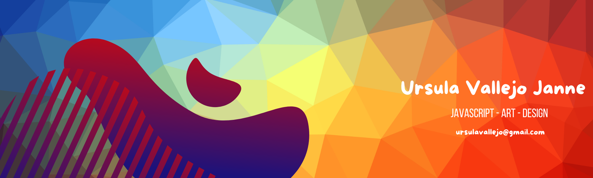
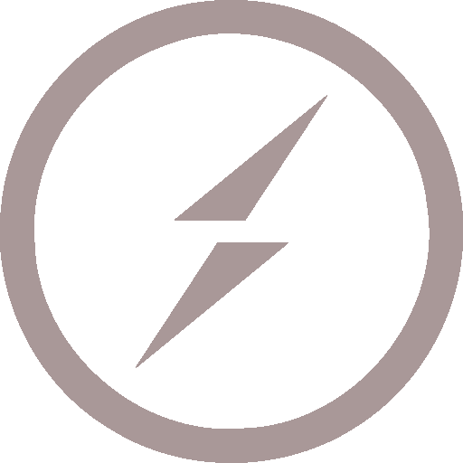

  <!-- Main banner -->
  

<h1>Hello, I’m <strong>Ursula !!</strong></h1>

✨ A goal-driven Full-Stack JavaScript Developer with a background in Arts and Design. I merge creativity and logic to craft accessibility-first, user-centric experiences that look as beautiful as they perform.
Passionate about blending design & tech to build meaningful products,
I spend my free time experimenting with laser-cut creations, some creative projects, and volunteering to teach kids how to code.

🌍💡I believe we all have the power to inspire and grow together, building a more equitable and inclusive society where everyone has space to flourish.

---

## About Me & Current Focus

 

📍 Based in Gothenburg, Sweden

🎨 B.Sc. in Art @ Andes University (Bogotá, Colombia)

  <!-- Currently learning -->
  
 JavaScript Developer program @ IT Högskola (2025)

🌱 Deepening skills in **TypeScript**, **Nuxt 3 & Vue 3** and **accessibility testing (Cypress)**

---

<h3 align="left">💻  Languages and Tools:</h3>

<table
  border="1"
  cellpadding="10"
  cellspacing="0"
  width="100%"
>
  <tr>
    <th align="left" width="30%">
      JavaScript &amp; Type Safety: 
      <small>Crafting maintainable codebases, from vanilla JS to full TypeScript adoption.</small>
    </th>
    <td align="center" width="70%">
    
    </td>

  </tr>

  <tr>
    <th align="left" width="30%">
      Frameworks: 
      <small>Building dynamic, component-driven UIs with SEO-friendly frameworks.</small>
    </th>
    <td align="center" width="70%">
    
    </td>
  </tr>

  <tr>
    <th align="left" width="30%">
      UI &amp; Styling: 
      <small>Turning wireframes into polished UI with modern CSS and design systems.</small>
    </th>
    <td align="center" width="70%">
    
    </td>
  </tr>

  <tr>
    <th align="left" width="30%">
      Backend &amp; APIs: 
      <small>Architecting REST &amp; GraphQL services, real-time features and server-side rendering.</small>
    </th>
    <td align="center" width="70%">
    
        
    </td>

  </tr>

  <tr>
    <th align="left" width="30%">
      Databases &amp; Persistence: 
      <small>Reliable data models and migrations for small apps up to enterprise-scale systems.</small>
    </th>
    <td align="center" width="70%">
    
    </td>
  </tr>

  <tr>
    <th align="left" width="30%">
      Tools &amp; Hosting: 
      <small>CI/CD, fast bundles and smooth deployments on modern platforms.</small>
    </th>
    <td align="center" width="70%">
    

    </td>
  </tr>

  <tr>
    <th align="left" width="30%">
      CMS &amp; Testing: 
      <small>Contentful </small>
    </th>
    <td align="center" width="70%">
    
    

    </td>
  </tr>
</table>

## 🚀 Selected Projects

| Project                          | Description                                                                                    | Link                                   |
| -------------------------------- | ---------------------------------------------------------------------------------------------- | -------------------------------------- |
| **Crypto Quest**                 | A Next.js game interface for crypto education, with reusable UI library in Sass & TailwindCSS. | 🔗 [github.com/ursula/crypto-quest](#) |
| **GetHub Landing Page**          | Marketing site for mobile app built with Next.js, GraphQL & Contentful for dynamic content.    | 🔗 [github.com/ursula/gethub-page](#)  |
| **Municipal Reports Modernizer** | Nuxt3 + Vue3 app to modernize municipal reporting systems; focused on accessibility & testing. | 🔗 [github.com/ursula/muni-reports](#) |

---

<h3 align="left">📫 Connect with me:</h3>

<table cellpadding="5">
  <tr>
    <td valign="middle" width="40">
      
    </td>
    <td valign="middle">
      Email: ursulavallejo@gmail.com
    </td>
  </tr>

  <tr>
    <td valign="middle" width="40">
      
    </td>
    <td valign="middle">
      LinkedIn: <a href="https://linkedin.com/in/ursula-vallejo-janne" target="_blank">Ursula Vallejo Janne</a>
    </td>
  </tr>

  <tr>
    <td valign="middle" width="40">
      
    </td>
    <td valign="middle">
      CodePen: <a href="https://codepen.io/@ursulavallejo" target="_blank">@ursulavallejo</a>
    </td>
  </tr>
</table>

---

  in progress ,last update 2025

