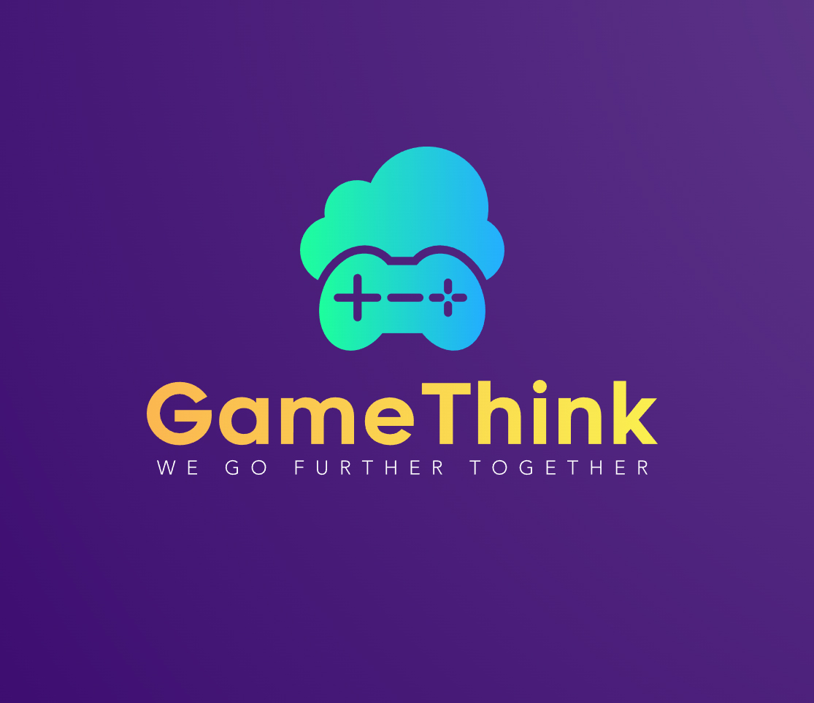
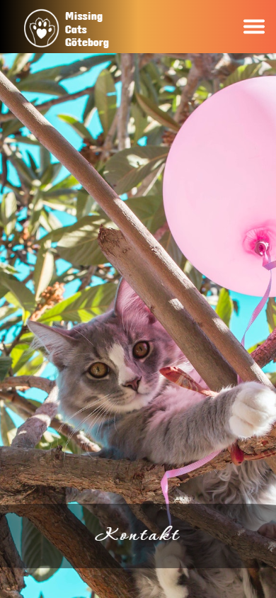

  <!-- Main banner -->
  

# Hello, I’m <strong>Ursula !!</strong>

✨ A goal-driven Full-Stack JavaScript Developer with a background in Arts and Design. I merge creativity and logic to craft accessibility-first, user-centric experiences that look as beautiful as they perform.
Passionate about blending design & tech to build meaningful products,
I spend my free time experimenting with laser-cut creations, some creative projects, and volunteering to teach kids how to code.

🌍💡I believe we all have the power to inspire and grow together, building a more equitable and inclusive society where everyone has space to flourish.

---

## About Me & Current Focus

 

📍 Based in Gothenburg, Sweden

🎨 B.Sc. in Art @ Andes University (Bogotá, Colombia)

 JavaScript Developer program @ IT Högskola (2025-Gothenburg, Sweden)

👩🏻‍💻 Web Developer program @ Campus Möndal (2022-Gothenburg, Sweden)

  <!-- Currently learning -->

🌱 Deepening skills in **TypeScript**, **Nuxt 3 & Vue 3** and **accessibility testing (Cypress)**

---

[⬇️ Download my CV-English (PDF)](assets/FullstackDeveloper_UrsulaVallejoCV_EN.pdf) | [⬇️ Download my CV-Swedish (PDF)](assets/Fullstackutvecklare_UrsulaVallejoCV_SV.pdf)

**Note**: On GitHub, clicking the link will open the PDF in your browser. Use the download button there to save a copy to your device.

---

<h3 align="left">💻  Languages and Tools:</h3>

<table
  border="1"
  cellpadding="10"
  cellspacing="0"
  width="100%"
>
  <tr>
    <th align="left" width="30%">
      JavaScript &amp; Type Safety: 
      <small>Crafting maintainable codebases, from vanilla JS to full TypeScript adoption.</small>
    </th>
    <td align="center" width="70%">
    
    </td>

  </tr>

  <tr>
    <th align="left" width="30%">
      Frameworks: 
      <small>Building dynamic, component-driven UIs with SEO-friendly frameworks.</small>
    </th>
    <td align="center" width="70%">
    
    </td>
  </tr>

  <tr>
    <th align="left" width="30%">
      UI &amp; Styling: 
      <small>Turning wireframes into polished UI with modern CSS and design systems.</small>
    </th>
    <td align="center" width="70%">
    
    </td>
  </tr>

  <tr>
    <th align="left" width="30%">
      Backend &amp; APIs: 
      <small>Architecting REST &amp; GraphQL services, real-time features and server-side rendering.</small>
    </th>
    <td align="center" width="70%">
    
        
    </td>

  </tr>

  <tr>
    <th align="left" width="30%">
      Databases &amp; Persistence: 
      <small>Reliable data models and migrations for small apps up to enterprise-scale systems.</small>
    </th>
    <td align="center" width="70%">
    
    </td>
  </tr>

  <tr>
    <th align="left" width="30%">
      Tools &amp; Hosting: 
      <small>CI/CD, fast bundles and smooth deployments on modern platforms.</small>
    </th>
    <td align="center" width="70%">
    

    </td>
  </tr>

  <tr>
    <th align="left" width="30%">
      CMS &amp; Testing: 
      <small>Contentful </small>
    </th>
    <td align="center" width="70%">
    
    

    </td>
  </tr>
</table>

  <!-- Stats languages -->

---

## 🚀 Selected Projects

| Preview                                                                                                                                                                                      | Project          | Description                                                                                                                                                                                                                                                       | Tech                                                                                                                                                                                                                                                                                                                                                                                                                                                                                                                                                                                                                                                                                                                                                                                                                                                                                                                                                                              | Link Repo                                                                                       |
| -------------------------------------------------------------------------------------------------------------------------------------------------------------------------------------------- | ---------------- | ----------------------------------------------------------------------------------------------------------------------------------------------------------------------------------------------------------------------------------------------------------------- | --------------------------------------------------------------------------------------------------------------------------------------------------------------------------------------------------------------------------------------------------------------------------------------------------------------------------------------------------------------------------------------------------------------------------------------------------------------------------------------------------------------------------------------------------------------------------------------------------------------------------------------------------------------------------------------------------------------------------------------------------------------------------------------------------------------------------------------------------------------------------------------------------------------------------------------------------------------------------------- | ----------------------------------------------------------------------------------------------- |
|    | **Game Think**   | GameThink is an Expo-powered React Native mobile app for discovering, browsing, and sharing your favorite games. I designed and built the entire UI—including the logo and all screens.                                                                           |                                                                                                                                                                                                                                                                           | 🔗[gameThink_ReactNativeAppt ](https://github.com/Ursulavallejo/gameThink_ReactNativeApp)       |
|         | **Drakens Sked** | Drakens Sked is a collaborative, Vite-powered Vue 3 SPA that lets you browse recipes from a local JSON, flip through step-by-step instructions like a book, play nutrition mini-games, and filter meals by selected criteria.                                     |                                                                                                                                                                                                                                                                                                                                                                                            | 🔗 [Drakens Sked_Vue 3 single-page application ](https://github.com/Ursulavallejo/drakens-sked) |
|  | **Missing Cats** | Full-stack site for Missing Cats Göteborg, built with Contentful, Next.js, TypeScript, JavaScript, and Sass. It lets the team self-manage news, success stories, and updates—raising awareness and donations without technical support.                           |                                                                                                                                                                                                                                                                                                                                                                                                                            | 🔗 [Missing Cats_WebApp ](https://github.com/Ursulavallejo/forening-missing-cats-gtb)           |
|           | **Trivia Game**  | Trivia-App Tester & TypeScript is a full-stack TypeScript trivia app—React/TSX front end, Node.js/Express back end, PostgreSQL storage—with full CRUD, responsive UI, and comprehensive Cypress tests (E2E, integration, component) automated via GitHub Actions. |                                                                                                | [TriviaGame_E2E_Tests ](https://github.com/Ursulavallejo/TriviaGame_E2E_Tests)                  |
|        | **Travel Blog**  | Travel Blog is a collaborative full-stack app for adventure lovers to share and explore travel stories. It features a React/Bootstrap frontend, Node.js/Express API, PostgreSQL storage, and is containerized with Docker Compose and served via NGINX on Azure.  |        | 🔗 [Travel Blog_Fullstack ](https://github.com/Ursulavallejo/Labb2_travelBlog)                  |

---

### 📫 Connect with me:

    
    &nbsp;Email:
   <a href="mailto:ursulavallejo@gmail.com" target="_blank">
   ursulavallejo@gmail.com
    </a>

    
  &nbsp;LinkedIn: <a href="https://linkedin.com/in/ursula-vallejo-janne" target="_blank">Ursula Vallejo Janne</a>

    
  &nbsp;CodePen: <a href="https://codepen.io/@ursulavallejo" target="_blank">@ursulavallejo</a>

---

  <!-- Snake game -->
<picture>
  <source media="(prefers-color-scheme: dark)" srcset="https://raw.githubusercontent.com/ursulavallejo/ursulavallejo/output/github-snake-dark.svg" />
  <source media="(prefers-color-scheme: light)" srcset="https://raw.githubusercontent.com/ursulavallejo/ursulavallejo/output/github-snake.svg" />
  
</picture>

  in progress ,last update 2025

